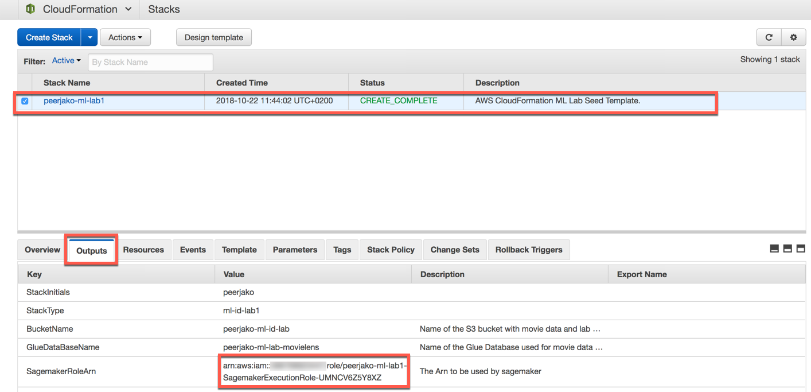
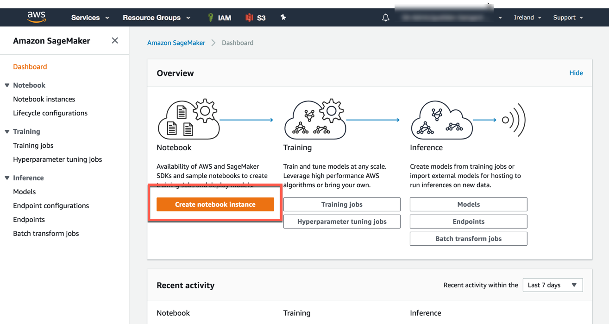
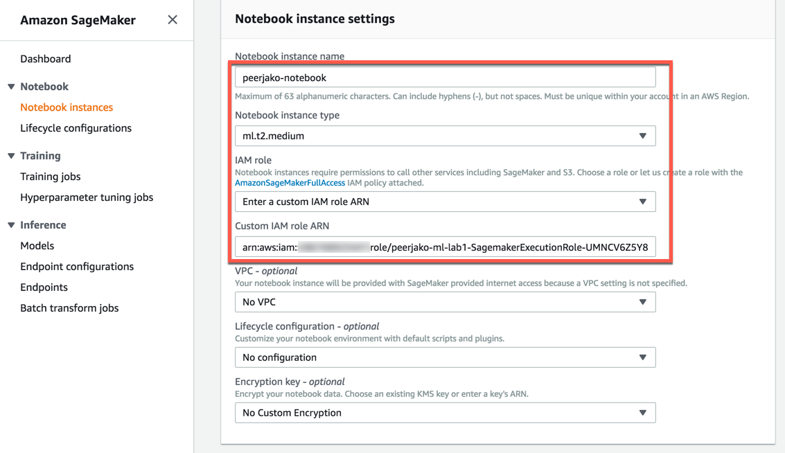
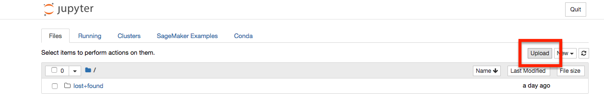

# Lab2 - Model training, testing and deploying with Amazon SageMaker
In the second lab, you are going to extract value from the data you got to know in the first lab.

### <a name="setup">Setup an Amazon Sagemaker Notebook</a>

1. In case you have been logged out, sign into the AWS Management Console <https://console.aws.amazon.com/>, and confirm that you are working the correct region.

2. We will need the value of the SagemakerRoleArn resource created by the CloudFormation stack from Lab 1. Use [this link](https://console.aws.amazon.com/cloudformation/home#/stacks?filter=active) to go to the CloudFormation console, click on the **row** of your stack (do not click the name), click the **Outputs** tab and copy the **Arn Value** of the SageMakerRoleArn output. Save this value for later, you will soon need it.

   

3. Now use [this link](https://console.aws.amazon.com/sagemaker/home#/landing) to go to Amazon Sagemaker dashboard. 

4. Start creating a Notebook by clicking **Create notebook instance** on the Amazon Sagemaker dashboard.

5. Enter the Sagemaker Notebook settings required to create the Notebook. These are

- Notebook instance name:  **[Your-initials]-ml-id-recommender**
- Notebook instance type: **ml-t2-medium**
- IAM role:
  - Choose **Enter a custom IAM role ARN**
  - Enter the SageMakerRoleArn that was part of the output from the CloudFormation stack into the **Custom IAM role ARN** field. This role gives sagemaker access to the bucket created in the CloudFormation stack.

6. Lastly, click **Create notebook instance**, then wait for the instance to have status **InService**

***

##Jupyter Notebook Lab

The rest of this lab will be done by working through the notebook document, which has three major parts:

- Data preparation
- Sagemaker Model Training
- Deploy Endpoint and Test Inference

1. On the Notebook instances page in Amazon SageMaker, open the notebook by clicking the **Open** link in the Actions column. A new browser tab will open showing the notebook home screen.

2. For this lab, you will be using a prepared Jupyter Notebook document. To import it, click **Upload** in the top right section of the notebook home screen. Navigate to the **Lab2** folder of the locally downloaded Immersion Day material and select the **ML-Immersion-Day-Lab-2.ipynb** file.

    

3. The document is uploaded and should appear in the files list of the home screen. Open it by clicking on it, which will open a new browser tab. **Continue working with the lab from there.**

